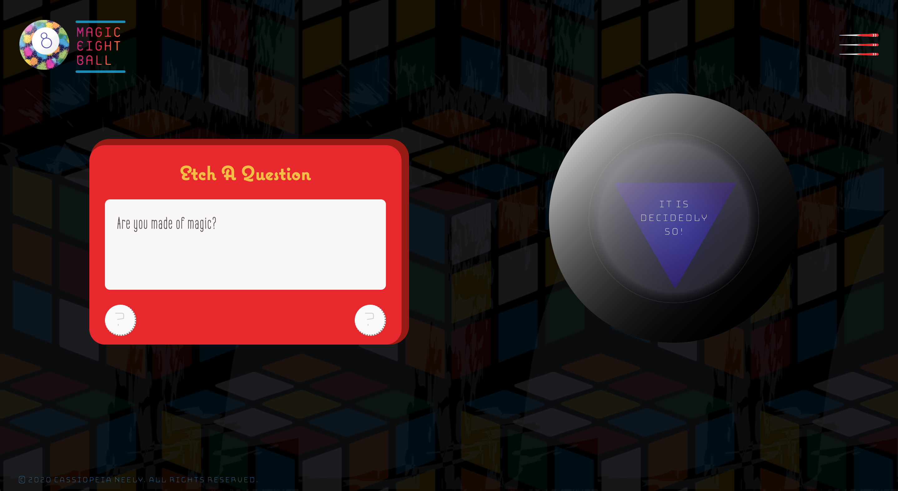

# Magic Eight Ball

## Table of Contents

 + [Introduction](#introduction)
 + [Features](#features)
 + [Favicon](#favicon)
 + [Tech Specs](#tech-specs)

## Introduction

 

 Are you destined to be a millionaire? Will this dystopian nightmare ever end? Ask the [Magic Eight Ball](https://cassiopeian.github.io/magic-eight-ball/)!

## Features
 
 

 Once you’ve “etched” your question and selected a dial, the Magic Eight Ball will jiggle slightly, before revealing a sage response.

## Favicon

 

 This project pays homage to popular vintage toys, so the favicon was styled to look a bit dated. With its acid wash texture and bright neon colors, any ’80s kid would approve.

## Inspiration

 

## Tech Specs

 Magic Eight Ball was built with jQuery version 3.4.1.
